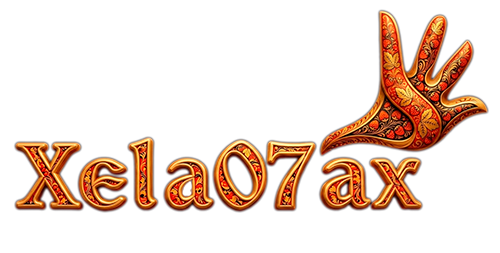

  
  
  <h1>Привет, я Алексей Ердяков! ⚡</h1>
  <h3>Fullstack-архитектор | Elite Go Developer | Технологический лидер</h3>
  
  
<b>Инженерный опыт: 10+ лет | Профильный Go (Golang): 6+ лет</b>

  
<i>Проектирую отказоустойчивые High-End решения (до 1M RPS) и оптимизирую системы.</i>

  ---

### 🚀 Обо мне
Специализируюсь на security-first архитектурах (Zero Trust, DPI, DLP), высоконагруженных бэкендах и минималистичном коде без over-engineering. Имею успешный опыт бесшовной миграции критической бизнес-логики с Python, Node.js, PHP, Java на Go. Активно использую AI (Gemini Pro, Claude) как полноправных партнеров по System Design и написанию кода.

### 🛠 Стек технологий
* **Backend & Core:** Go (Golang), gRPC, микросервисы, асинхронные паттерны.
* **Databases & Infra:** PostgreSQL, Redis, ClickHouse, Docker, MinIO (S3), Linux.
* **Frontend:** React, Vue.js.
* **Архитектура:** Spill-to-disk стратегии, строгий контроль памяти.

### 💻 Избранные проекты

* **[Страж СУА (iiFix.ru)](https://iifix.ru)** — AI Gateway и платформа управления безопасностью. Ядро на Go, встроенный Lua-движок для применения политик "на лету" и админка на React. Единая модель управления (Consumer) и строгая верификация токенов (RS256).
* **[chLogger]** — Высокопроизводительный асинхронный логгер на каналах для Go, оптимизированный для потоковой записи огромных массивов данных в ClickHouse.
* **[Luna Tasks]** — Пример чистой архитектуры: API для управления задачами с упором на безопасность и читаемость кода.

   
  

